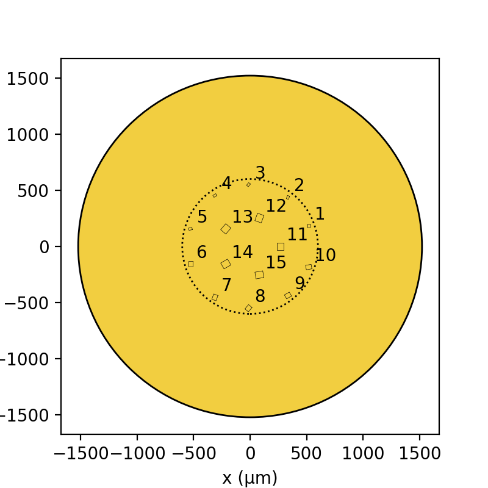

#Description

A script for generating condenser aperture designs for transmission electron microscopy (TEM)

#System Requirements

Standard desktop

Anaconda Python (https://www.anaconda.com/download) or miniconda (https://docs.conda.io/projects/miniconda/en/latest/miniconda-install.html)

Python packages:
numpy (https://numpy.org/)
matplotlib (https://matplotlib.org/)
ezdxf (https://pypi.org/project/ezdxf/)

Tested on ezdxf v 4.1.1, numpy v 1.21.5 and matplotlib v 3.5.1 and python v 3.9.12 though it should be compatible with earlier versions of each package

#Installation Guide

Should take 15 minutes with a modern desktop and fast internet connection

Install Anaconda python or miniconda using the graphical installers

Install numpy,matplotlib and ezdxf, within an commandshell with access to anaconda python execute the following command:
pip install numpy matplotlib ezdxf

#Demo

Run the script in a python interpreter:
python Generate_apertures.py

The script should take less than 5 seconds.

A folder "Apertures" will be created which contains AutoCAD dxf files of the apertures and pdf and png versions of the apertures.

Instructions
------------
To generate custom aperture plate designs modify

